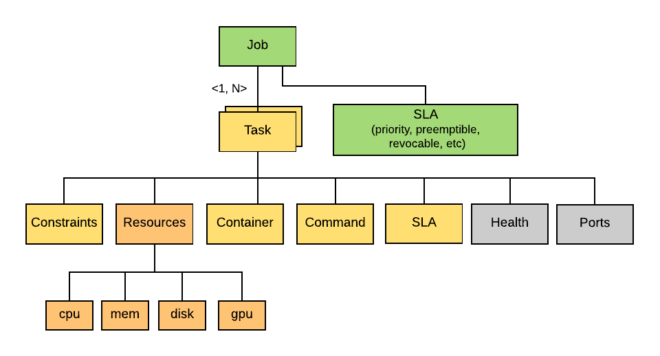
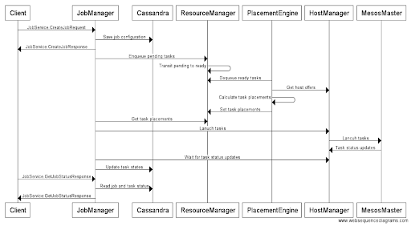
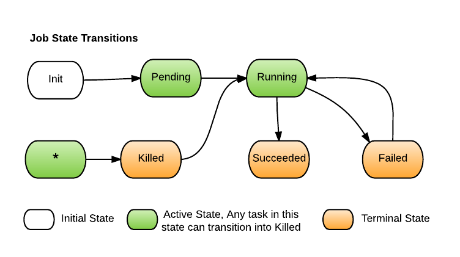
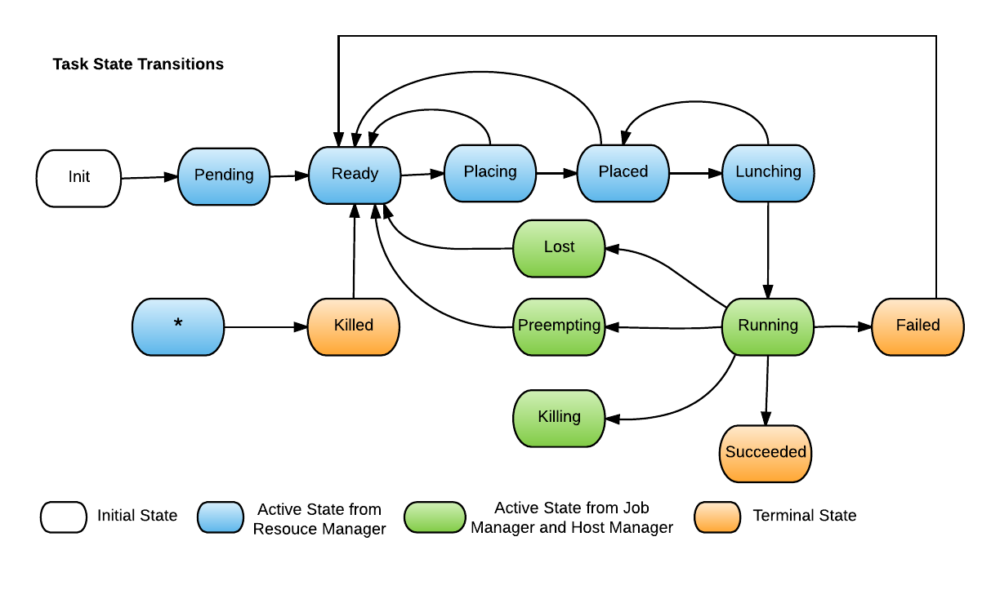
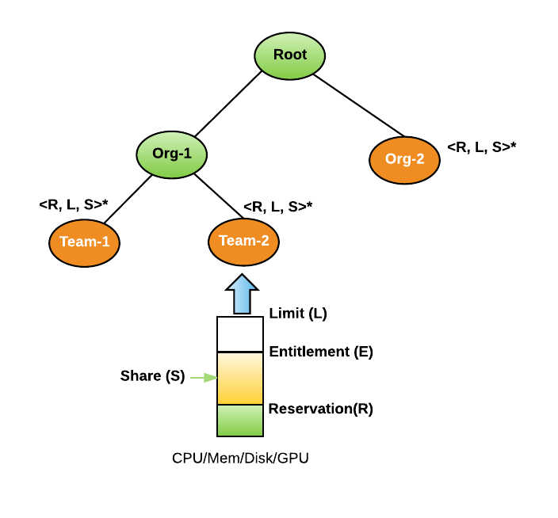
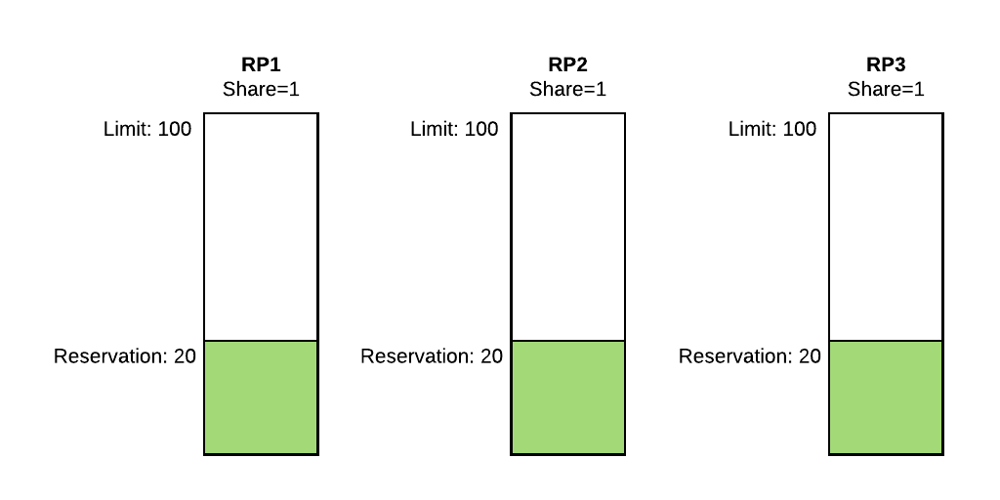
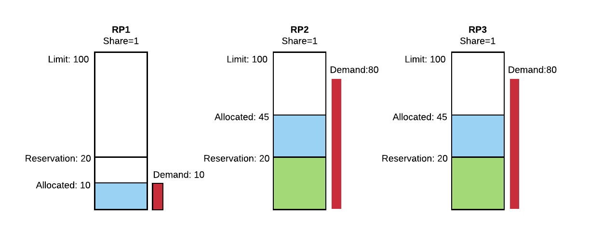
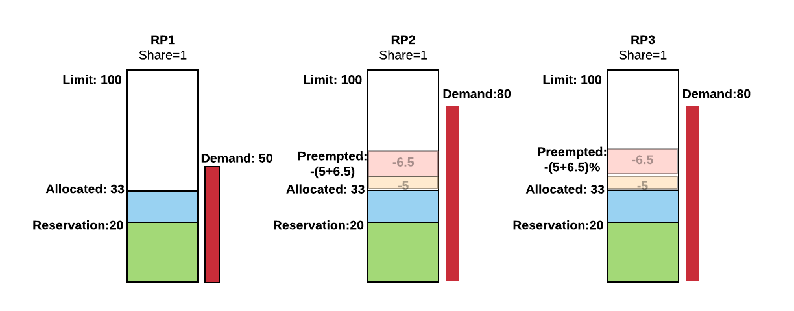
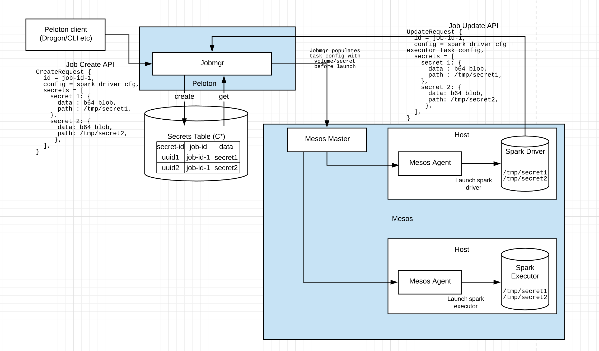

# Peloton User Guide

Peloton supports for the following four types of jobs - batch,
stateless, stateful and daemon.

- **Batch Jobs** are jobs which typically take a few seconds to a few
days to complete. There are a broad category of batch jobs for
developer experience, data analytics, machine learning etc such as
Spark, Hive, Tensorflow etc. These jobs tend to be less sensitive to
short-term performance fluctuations due to cluster resource shortage,
and quite often are preemptible by nature.

- **Stateless Jobs** are long running services which should never go
down and have no persistent state on local disk. Most web backend
applications belong to this category. These jobs have a strict SLA and
only few of the instances of this job are allowed to be unavailable at
a given time.

- **Stateful Jobs** are also long running services which should never go
down, but these jobs have persistent states on local disks. Examples
of such jobs include Cassandra, Redis, MySQL etc. These jobs are not
only not preemptible but are also very expensive to relocate to other
hosts due to their local persistent states.

- **Daemon Jobs** are the agents running on each host for infrastructure
components such as for statistics collection. Daemon jobs are neither
preemptible nor relocatable.

##  Job and Task Definitions

In Peloton, a Job is one or more instances of the same executable,
running on a Cluster. Each instance of a Job is called a Task that
contains the executable to run, the arguments to the executable, and
other metadata such as resource requirements, container image, and
port configuration, etc.



A Job or Task’s resource requirements are in the form of a vector of multiple 
resource types <cpu, memory, disk-size, gpu>. 
In a Job definition the user can specify how many resources they need for each 
Task and how many Tasks they need. Note that resource requirements are the upper
limit of how much resource a Task might use. 
In reality, the runtime of a Task might use much less resources than the limit. 
The difference between the limit and the actual usage is called Slack which 
could be future allocated to other lower-priority Tasks via revocable offers 
from Mesos.

Each Job has an SLA configuration that specifies the Priority, Preemptibility, 
and  Revocability of a Job. 

A Job can also be restricted to a subset of the hosts by specifying a list of 
Constraints. Peloton will take those constraints into account when computing 
the placement decisions for the tasks. These constraints can be of the form of 
soft and hard constraints. For soft constraints, Peloton will try its best to 
place those tasks on the desired hosts with the requested capabilities. 
If the soft constraints can not be satisfied after a configured timeout, the 
tasks will be placed to other hosts. 
For hard constraints, the tasks will not be scheduled until the constraints are 
satisfied, which could lead to higher latency and potential task starvation.


### Job and Task Lifecycle

In Peloton, a job represents a set of tasks that will be scheduled to run on a 
cluster. It contains both the common and the per-task specific configurations. 
When a job is submitted to Peloton via job manager, the job configuration is 
first written into Cassandra as the goal state. Then job manager parses and adds
each individual task into the pending task queue of the given resource pool in 
resource manager. When there is available resource in the resource pool, the 
pending tasks will be transited to ready state and dequeued by one of the 
placement engines for calculating placement decision. Then job manager will use 
the placements to launch tasks on Mesos via host manager. 

Next shows the detailed sequence diagram of a job creation workflow in Peloton

  



#### Job State Machine

For each job, Peloton use a state machine to represent its state, and the logic
to transition state according to various events happened to the tasks of the job. 
Peloton defines the following states for job, shown in the following state 
transition diagram:




#### Task State Machine

For each task, Peloton use a state machine to represent its state, and the 
logic to transition state according to various events happened to the task. 
Peloton defines the following states for task, shown in the following state 
transition diagram: 





### Stateless Job Update Lifecycle

When Peloton receives a request to update a stateless job, it will
persist the request into storage and mark update as
`INITIALIZED`. Then the state would change according to runtime
state and update configuration.


#### ROLLING FORWARD To SUCCEEDED:

As soon as an update is processed by Peloton, it would transit to
**ROLLING FORWARD** state. It means tasks in the job are being
updated, respecting update spec and job SLA.  As soon as all the tasks
needed to be updated in the job have been processed, update would
transit into **SUCCEEDED** state.

#### ROLLING BACKWARD, ROLLED BACK And FAILED

Peloton decides whether an update is successful given the UpdateSpec
provided.

If **RollbackOnFailure** is set in UpdateSpec, update would enter
**ROLLING BACKWARD** state. Peloton would try to rollback the job to
the previous configuration. If rolling back fails, update would enter
**FAILED** state. If rollback back succeeds, update would terminated
with **ROLLED BACK** state.

If **RollbackOnFailure** is set in UpdateSpec, update would enter **FAILED** state
directly.

#### ABORTED and PAUSED

Any non-terminal state can transit to **ABORTED**/**PAUSED** state
upon user's request. The major difference is that update can still
resume with original state after it enters **PAUSED** state, but once
update enters **ABORTED** state it would end up with the state.

Another difference is that, update would be in **PAUSED** state only
when user explicitly pauses an update. But, update can be in
**ABORTED** state not only when user aborts an update but also when it
is overwritten by a new update.


## Resource Pools

Resource Pool is a logical abstraction for a subset of resources in a
cluster. All resources in a cluster can be divided into hierarchical
resource pools based on organizations and teams. A resource pool can
contain child resource pools to further divide the resources within an
organization. Resource sharing among pools are elastic in nature.
Resource pools with high demand can borrow resources from other pools if
they are not using those resources. When a user submits a job, she must
provide a leaf resource pool where the resources of the job will be
accounted for. The resource pool tree is typically managed by Compute
SRE team but the management of the sub-trees within an organization can
be delegated to the organization's SRE team.

Every resource pool has different resource dimensions, such as CPU,
Memory, Disk Size and GPU. The number of resource dimensions will
increase in the future when Mesos supports more resource isolations such
as Disk IO.There are three basic resource controls for each resource
dimension in a resource pool, i.e. Reservation, Limit, and Share. These
settings can be used to provide different resource allocation policies
for organizations.

Reservation is the minimal guarantee of resources for a resource pool.
Cumulative resource reservation across all pools can not be more than a
cluster capacity. This has to be configured carefully as that would be
the guiding factor for defining and meeting SLA's.

Limit is the maximum resources a resource pool can consume at any given
time. Every resource pool can expand more than its reservation to this
limit in case the cluster is free. At some point if more guaranteed
workloads in other pools come to the cluster then we will give back
those resources. These resources (which are more than the reservation)
will not be guaranteed and is revocable in nature.

Share specifies the relative weight a resource pool is entitled to
allocate when there is free capacity in the cluster. Similarly when
preemption will kick in it will preempt the workloads based on the share
as well. Least share will have more preemption.

Entitlement is the amount of resources which each resource pool can use
across different resource hierarchies at any given point of time. This
is a changing value which is based on demand in the resource pool and
free resources in the cluster at that moment.

Allocation is the amount of resources which each resource pool is using
(Allocated) at any given point of time.



Picture above shows an example resource pool tree with two child
resource pools, i.e. AVMaps and Simulation. All resources in the
cluster will be divided between these two organizations. Simulation is
a leaf resource pool since it does not have any teams. So users are
allowed to submit jobs at Simulation resource pool. However AvMaps has
two child resource pools for AV-Build and AV-Release, so the resources
in AVMaps will be further divided based on the resource pool settings
of AV-Build and AV-Release.

## Preemption

One of the features of Peloton is its ability to distribute unused
resources to other resource pools that have higher demand. These unused
resources are given to other resource pools with the understanding that
they might be taken back once the pool from which these were taken needs
it back again. Once the resources need to be given back, the tasks
running with those resources need to be preempted and re-enqueued for
admission control. This is central to improve the cluster's utilization.

Let's first recap the different resource pool dimensions. Resource pool
dimensions

1.  Reservation - Reservation specifies the guaranteed minimum resources
    for a resource pool.
2.  Entitlement - The set of resources this resource pool is entitled to
    use based on its demand. It can be more or less than its
    reservation.
3.  Share - Shares specify the relative priority or importance of a
    resource pool. If a resource pool has twice as many shares of a
    resource as another resource pool, it is entitled to consume twice
    as much of that resource when these two resource pool are competing
    for resources.
4.  Limit - Limit specifies an upper bound for a resource that can be
    allocated to a resource pool.
5.  Allocation - The resources actually allocated to the jobs in a
    resource pool. A resource pool can allocate more than the
    reservation, but never allocates more than the limit, even if there
    is unutilized CPU or memory on the system.
6.  Demand - Demand specifies the number of resources waiting to be
    admitted to the resource pool.

### Resource Sharing between Resource Pools

To understand how resource sharing works, let's work through an example.

Example 1: Let's say there are 100 resource units (e.g. CPU cores) in
the cluster. We have three resource pools with Reservation of 20, Limit
of 100, and Share of 1.



If there is enough demand in each resource pool, then 40 unreserved
resource units and any free resources will be divided equally to each
resource pool because each resource pool has equal share in the cluster.
However, if a resource pool doesn't have enough demand, then its
allocation will be equal to the demand but less than the reservation. .

Figure 2 shows there is 10 demand in RP1 and 80 demand in both RP2 and
RP3. As the resource demand in RP1 is less than its reservation, it only
gets the 10 resource units. For RP2 and RP3, their demands are 80 which
is much higher than their reservation, so their reservation will be
satisfied first. After the reservations of all resource pools are
satisfied, the remaining free resources in the cluster will be
distributed to pools based on their shares. In this case, there are 40
unreserved resource units and 10 unused from RP1, so the total 50
resource units will be divided equally between RP2 and RP3 since they
have the same share of 1.



Based on the above example we see that resource pools can share unused
resources amongst each other depending on the demand. However, once
resources are loaned to other resource pools, they might need to be
taken back if the lender pool has increased demand. To support the
concept of elastic resources, Peloton needs to preempt certain tasks
from a resource pool if the revocable resources are taken back from it.

Based on above Example 1, let's say at time T1, RP1 has a new demand of
50 resource units as shown in Figure 3 (RP2 and RP3 remain the same). In
the next scheduling cycle, the entitlement of RP1 will become 33 (that
is, 100 total resource units divided equally among all three pools), and
we now need to take 23 resources from RP2 and RP3---rescinding part of
their loans---to give back to RP1. Since RP2 and RP3 have the same
share, they will both have to release same number of resources to make
available for RP1. In this case, it would be 23/2 = 11.5.

The preemption will happen in two stages conceptually: 1. First, it will
try to satisfy the reservation of RP1 20), so it needs 10 more
resources; 10/2=5 will be taken away from each competing resource pool
(RP2 and RP3).

2.  Second, the remaining 23-10=13 resources will also be taken to
    ensure all three pools have the same entitlement: 13/2=6.5 will be
    taken away from each competing resource pool (again, RP2 and RP3).



### Preemption Order

Once a resource pool is marked for preemption---i.e. it is using more
than its entitlement---then the scheduler will find and rank tasks for
preemption to free up those resources. The tasks are ranked in the
following order:

1.  State: Tasks that are still PENDING (i.e. haven't started running in
    the cluster yet) are higher in the order to be preempted.
2.  Priority: The tasks' priority (which is local within a resource
    pool).
3.  Runtime: Tasks that have been running for a shorter time are higher
    in the order to be preempted.

Once the tasks are filtered and ranked they are sent for preemption.

### Job Level Preemption

Currently peloton only supports preemption at the Job level. This means
that if the job is marked as preemptible in the Job\'s
[SlaSpec](apidoc.md/#peloton.api.v1alpha.job.stateless.SlaSpec) then all
tasks in the job will be preemptible as well and vice versa.

### Preemption FAQ

-   Should I mark my jobs as preemptible or non-preemptible?

    There is no right answer here since it's a trade off and depends on
    the individual Job, but here are some considerations to keep in
    mind:

    -   If the job is marked as preemptible,
        -   It will be able to use the revocable resources assigned to
            its resource pool. That is, the Job will be able to use more
            than the resource pool's reserved resources, provided that
            there are unallocated resources available in the cluster..
        -   The tasks of the Job can be preempted, so the tasks should
            be designed to be idempotent (tolerant of being stopped and
            starting again later).
    -   If the job is marked as non-preemptible,
        -   It will only use the reserved resources of the resource
            pool. Even if there are revocable resources available, it
            won't be admitted if all the reserved resources are
            allocated.
        -   The tasks of the job won't be preempted to make way for
            other tasks.

-   How is the task preempted?

    > When a task is preempted(essentially killed) it is sent a
    > **SIGTERM** , there's a 5 second grace period after which it is
    > sent a **SIGKILL**

-   Will my task be restarted after preemption?

    > You can control the restart policy of the task in the [Task
    > Config](_static/apidoc.html#peloton.api.task.PreemptionPolicy)
    >
    > By Default the task will be rescheduled.

-   How does task priority affect preemption?

    > Priority is used by scheduler in 2 different places:
    >
    > -   Admission control: When the Jobs are submitted, they are
    >     admitted based on their priority; higher priority tasks will
    >     be admitted before lower priority tasks.
    > -   Preemption: When the tasks are ranked for preemption, lower
    >     priority tasks will be preempted before higher priority tasks.
    >
    > For a non-preemptible Job, priority is only used during admission
    > control.

-   Does Peloton support preemption within a resource pool (a.k.a
    Priority Preemption) ?

    There are 2 types of preemption:

    -   **Inter resource pool preemption**: This will enforce the max
        min fairness across all resource pools.This will apply
        preemption policies on the resources and claim back resources
        from the resource pools. The Admin should be able to plug in
        different preemption policies and preemption will happen based
        on the policy. We will try to use the Min-Max Fairness
        preemption Policy for the inter resource pool preemption.
    -   **Intra resource pool preemption**: This will enforce
        entitlement within the resource pool. Every pool could have many
        users and each of them has many jobs running. It may often
        happen that one user can use the capacity of the full resource
        pool and other users will wait for those jobs to finish. This
        will lead to SLA miss for the jobs which are stuck in the pool.
        Other scenario is, it may happen that the lower priority jobs
        are running and if higher priority job comes in then the
        scheduler has to make space for the higher priority jobs.

    Peloton currently only supports \"Inter resource pool preemption\".
    \"Intra resource pool preemption\" should be added in H1 2019.


## Secrets Management

This section describes distributing containers secrets at runtime via Peloton

## Background

Spark workloads can be run on Peloton in a similar way as they are run on YARN.
Spark workloads that access secure HDFS clusters to run data processing on
secure PII data, do so using HDFS delegation tokens. Distributing secrets
securely on cluster schedulers is inherently a difficult task. YARN ecosystem
achieves this using Kerberos delegation tokens. YARN has a mechanism to
authenticate users, and pass along their delegation tokens to YARN application
manager. Kerberos is prevalent in Hadoop ecosystem but not widely supported
at Uber. In order to securely pass delegation tokens to Spark containers,
Peloton has devised a generic secrets distribution mechanism using Mesos secrets

Although the design is geared towards the Spark on Peloton use case, the feature
is generic and can be used to pass along any secrets (credentials, JWTs, AWS
access keys etc.) to the containers running on Peloton

### Architecture

Peloton uses Mesos volume/secret isolator to pass secrets from Peloton to
running containers via Mesos Master and Mesos slave. Peloton accepts a list
of secrets (base64 encoded data and container mount path) per job as part of
Job.Create() and Job.Update() API. Peloton securely passes along these secrets
via Mesos to the containers at runtime.

The secret proto message to describe job secrets looks like this:
```
    message Secret {
      message Value {
        // Secret data as byte array
        bytes data = 1;
      }
      // UUID of the secret
      SecretID id = 1;
      // Path at which the secret file will be mounted in the container
      string path = 2;
      // Secret value
      Value value = 3;
    }
```

Job Create/Update/Get API will support this secret proto message.
For further info, see the complete [API documentation](api-reference.md)

### Spark on Peloton workflow

Spark containers specifically use this as described below:



1.  Spark driver task is created on Peloton. At the time of creation, a
    delegation token is provided as a secret proto message to Peloton.
    The message contains the base64 encoded secret blob as well as the secret
    path (path at which the spark container will expect to read the secret).
    Multiple secrets can be provided during job creation.

2.  Peloton jobmgr creates a secret-id for each secret in job create request
    and stores it securely in Cassandra. Jobmgr adds a default task config to
    this job that contains the volume/secret container config which references
    the secrets by secret-ids

3.  Internally, default config for the job will have a container config like 
    this to describe secrets:
    ```
        "container":{
          "type": "MESOS",
          "volumes": [{
              "mode": "RO",
              "container_path": "/tmp/secret1",
              "Source": {
                  "type": "SECRET",
                  "secret": {
                      "type": "VALUE",
                      "value": {
                          "data": <secret id>,
                      }
                  }
              }
          }]
    ```

4.  At the time of task launch, Jobmgr will check if task config has a 
    volume/secret. If it finds a volume/secret config, it will replace the
    <secret-id> for each secret with secret data stored on Cassandra, and then
    launch the spark-driver task. Mesos agent on which this task has been
    scheduled will have a secrets isolator that will download the secret file
    locally on host at a tmpfs location

5.  Mesos isolator will then create a ramfs mount on the spark container and
    move the secret file to the location specified in Job Create API

6.  Spark-driver container will be able to read the delegation token from the
    mount path. It can then call Job.Update on its job ID along with the list of
    secrets, to add Spark-executor containers and pass on the delegation tokens
    to these new containers.

7.  Job Update will result in launching spark executor containers which then
    have access to the job secrets (delegation tokens) mounted at the path
    specified in Job Update API.

8.  Spark executor can now access secure HDFS tables using the delegation token

Peloton team is planning to add secrets as first class citizens with a CRUD API
in subsequent releases. We are also planning to support secret store plugins
like Vault to download secrets by reference on runtime.
